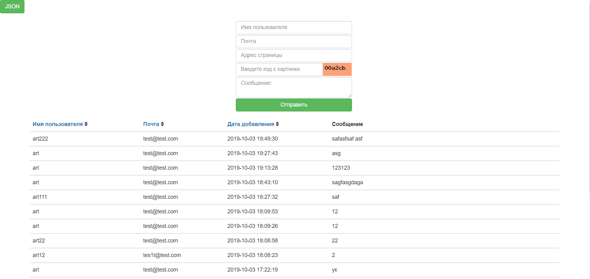

1 .Следующие данные сохраняются в БД в таблицу messages через форму: 
Имя пользователя 
Почта 
Домашняя Страница 
Сообщение 
ip адрес 
Информация о браузере 
Дата и время создания 
Дата и время обновления 

2 .В таблице присутсвуют данные для сортировки (Имя пользователя,Почта,Дата добавления )
и последним столбцом указано само поле сообщения.
 

3 .Запись в БД происходит только при правильно введеной КАПТЧЕ
 

4 .Есть пагинация в 25 элементов но сама строка пагинации появится при 25 и более записей.
 

5 .Все входные данные фильтруются от тегов через функцию strip_tags()
 

6 .Верстка сделана через Bootstrap.
 

7 .В левом верхнем углу кнопка которая отображает данные из Таблицы messages в json формате

